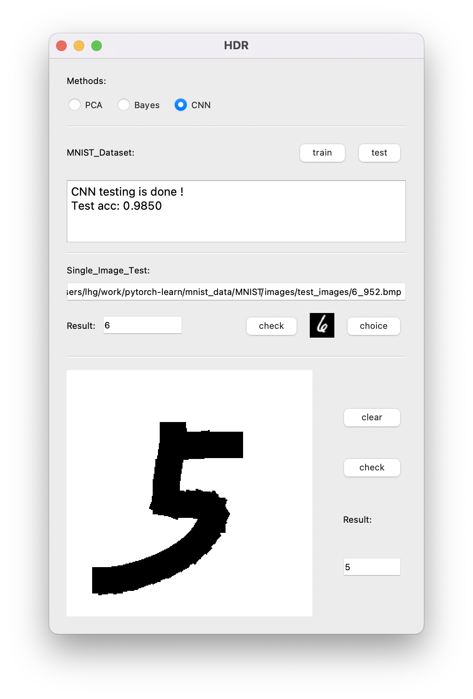

# HDR
### This is a handwritten digit recognition project based on the MNIST dataset.

#### Environmental requirements

- python == 3.7
- numpy == 1.21
- Pillow == 8.4
- PyQt5 ==5.15
- torch == 1.8

> The environmental requirements are not strict, as long as the version is not too old.

#### File Description

- main.py	The main function file provides an interface for the GUI, including tasks such as image loading and each task reasoning.
- hdr.py    GUI file.
- paintBoard.py    The paintboard file, which provides the GUI to display and refresh the paintboard module.
- pca.py     PCA implementation module, including PCA class and its member functions.
  - Due to the sorting computation of larger matrices, It will take a long time in the first training. Intermediate files of npy type will be saved.
- bayes.py    Bayes implementation module, including Bayes class and its member functions.
  - Intermediate files of npy type will be saved.
- cnn_model.py    CNN implementation module, including the structure of the classifier and the forward function.
  - The model is implemented with **2 conv** and **3 fc**, and the test accuracy is about 98.5%.
- cnn.py    CNN inference module, including test set inference and single image inference functions.
- mnistCls_net_param.pkl    Classifier parameter file.

#### How to Run

Once you have downloaded the file, run the following command:

```python
%cd HDR/
!python hdr.py
```

#### GUI display effect

<center>
    <center>GUI display effect</center>
    
</center>

> If you have any questions, please submit an issus (recommended) or contact me at liu.gravity@gmail.com.